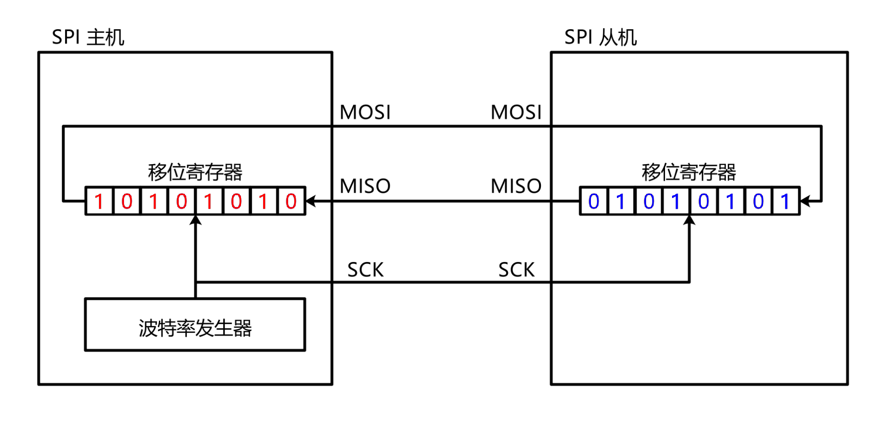
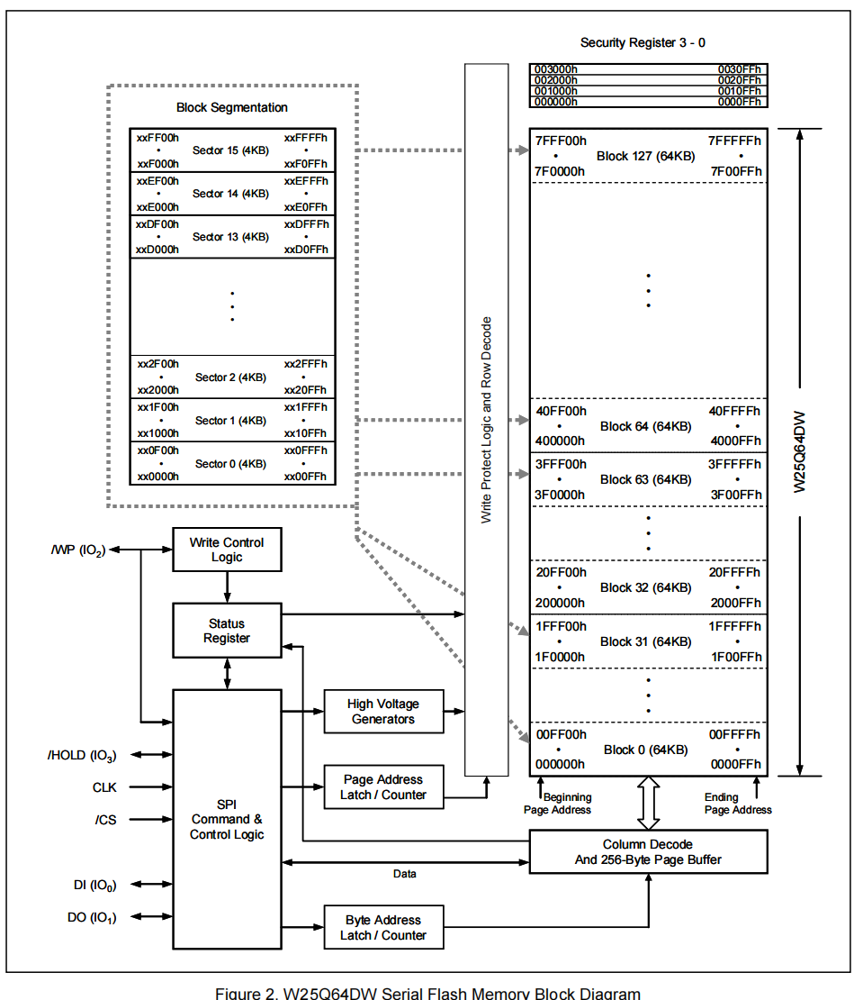

# SPI读写Flash

## 1. 什么是SPI?

- **同步**：发送方发送数据和接受方接收数据共享一个时钟，其本质是**共享时钟边沿**。
- **全双工**：数据发送和接收可以同时进行。
- **主从式**：通信分为**主设备**和**从设备**，主设备控制通信的发起和时序。
- **串行通信协议**：数据**逐位**传输。

## 2. SPI信号线

- **SCK(串行时钟)**：主设备产生的时钟信号，用于同步数据传输。
- **MOSI(主设备输出，从设备输入)**：顾名思义
- **MISO(主设备输入，从设备输出)：**顾名思义
- **CS/SS(片选信号)**：拉低此信号来选择目标从设备。

## 3. 数据传输流程

1. 初始化主从设备
	- 主从设备配置时钟极性（**Clock Polarity**，**Clock Polarity**）和时钟相位（**CPHA**，**Clock Phase**）,决定数据采用时机。
	- 从设备被片选信号拉低后，进入通信状态。
2. 生成时钟信号（SCK）
	- 主设备生成SCK信号，控制数据传输速率。每个时钟周期传输一个数据。
3. 全双工数据交换：
	- 主设备通过MOSI逐位发送数据，通过MISO逐位接收从设备数据。
	- 从设备通过MOSI逐位接受数据，通过MISO逐位发送数据给主设备。
	- 数据在时钟边沿被采样（看第四小节）

## 4. SPI的四种模式

- **CPOL(时钟极性)**
	- 空闲时的电平，=0低电平，=1高电平
- **CPHA(时钟相位)**
	- 决定数据采样和发送的时钟边沿，=0时钟的第一个边沿，=1时钟的第二个边沿。


| **模式** | **CPOL** | **CPHA** | **数据输出边沿**         | **数据采样边沿**         |
| :------- | :------- | :------- | :----------------------- | :----------------------- |
| Mode 0   | 0        | 0        | **下降沿**（SCK从0→1时） | **上升沿**（SCK从0→1时） |
| Mode 1   | 0        | 1        | **上升沿**（SCK从1→0时） | **下降沿**（SCK从1→0时） |
| Mode 2   | 1        | 0        | **上升沿**（SCK从1→0时） | **下降沿**（SCK从1→0时） |
| Mode 3   | 1        | 1        | **下降沿**（SCK从0→1时） | **上升沿**（SCK从0→1时） |

## 5. SPI硬件电路

输出引脚配置为**推挽输出（上升沿和下降沿都非常迅速，因此传输速率快）**，输入引脚配置为浮空或上拉输入。

**推挽输出：**是一种两个晶体管（**MOSFET**）组成的一种结构。

- 高电平驱动：
	- 上管导通：将输出连接到电源（VCC）,输出高电平（3.3V或5V）。
- 低电平驱动：
	- 下管导通：将输出连接到地（GND）,输出低电平（0V）。
- 特点：
	- 输出端能主动驱动高电平或低电平，无需外部上拉电阻。
	- 信号切换速度快，驱动能力强，适合高速通信。

## 6. SPI移位寄存器



**移位寄存器**上升沿发送数据，下降沿采样，以字节为单位。

## 7. W25Q64

- 非易失性存储器（掉电不丢失）

- 存储介质：nor Flash

- 时钟频率：80MHZ/160MHZ(两路)/320MHZ(四路)

- 存储容量（24位地址）：64Mbit/8MByte

- 存储框图：128个Block->16个扇区->256个页

	

## 8. Flash写入注意事项

1. 写入操作前，必须先进行写使能
2. 每个数据位只能由1改写为0，不能由0改写为1
3. 写入前必须擦除，擦除后，每个数据位都是1
4. 擦除必须按最小擦除单元进行，可整个flash擦除，可擦除一个block，可擦除一个sector，可擦除一个page。其中**page是最小单元**。
5. 每个时序最多写入**一页**（**256个字节**）的数据，超过页尾的数据会回到页首覆盖写入。
6. 写入操作接受后，芯片进入忙状态，不响应新的**读写**操作。

## 9. STM32读写W25Q64程序

### 9.1 SPI初始化

```c
#include "stm32f10x.h"                  // Device header

/*引脚配置层*/

/**
  * 函    数：SPI写SS引脚电平
  * 参    数：BitValue 协议层传入的当前需要写入SS的电平，范围0~1
  * 返 回 值：无
  * 注意事项：此函数需要用户实现内容，当BitValue为0时，需要置SS为低电平，当BitValue为1时，需要置SS为高电平
  */
void MySPI_W_SS(uint8_t BitValue)
{
	GPIO_WriteBit(GPIOA, GPIO_Pin_4, (BitAction)BitValue);		//根据BitValue，设置SS引脚的电平
}

/**
  * 函    数：SPI写SCK引脚电平
  * 参    数：BitValue 协议层传入的当前需要写入SCK的电平，范围0~1
  * 返 回 值：无
  * 注意事项：此函数需要用户实现内容，当BitValue为0时，需要置SCK为低电平，当BitValue为1时，需要置SCK为高电平
  */
void MySPI_W_SCK(uint8_t BitValue)
{
	GPIO_WriteBit(GPIOA, GPIO_Pin_5, (BitAction)BitValue);		//根据BitValue，设置SCK引脚的电平
}

/**
  * 函    数：SPI写MOSI引脚电平
  * 参    数：BitValue 协议层传入的当前需要写入MOSI的电平，范围0~0xFF
  * 返 回 值：无
  * 注意事项：此函数需要用户实现内容，当BitValue为0时，需要置MOSI为低电平，当BitValue非0时，需要置MOSI为高电平
  */
void MySPI_W_MOSI(uint8_t BitValue)
{
	GPIO_WriteBit(GPIOA, GPIO_Pin_7, (BitAction)BitValue);		//根据BitValue，设置MOSI引脚的电平，BitValue要实现非0即1的特性
}

/**
  * 函    数：I2C读MISO引脚电平
  * 参    数：无
  * 返 回 值：协议层需要得到的当前MISO的电平，范围0~1
  * 注意事项：此函数需要用户实现内容，当前MISO为低电平时，返回0，当前MISO为高电平时，返回1
  */
uint8_t MySPI_R_MISO(void)
{
	return GPIO_ReadInputDataBit(GPIOA, GPIO_Pin_6);			//读取MISO电平并返回
}

/**
  * 函    数：SPI初始化
  * 参    数：无
  * 返 回 值：无
  * 注意事项：此函数需要用户实现内容，实现SS、SCK、MOSI和MISO引脚的初始化
  */
void MySPI_Init(void)
{
	/*开启时钟*/
	RCC_APB2PeriphClockCmd(RCC_APB2Periph_GPIOA, ENABLE);	//开启GPIOA的时钟
	
	/*GPIO初始化*/
	GPIO_InitTypeDef GPIO_InitStructure;
	GPIO_InitStructure.GPIO_Mode = GPIO_Mode_Out_PP;
	GPIO_InitStructure.GPIO_Pin = GPIO_Pin_4 | GPIO_Pin_5 | GPIO_Pin_7;
	GPIO_InitStructure.GPIO_Speed = GPIO_Speed_50MHz;
	GPIO_Init(GPIOA, &GPIO_InitStructure);					//将PA4、PA5和PA7引脚初始化为推挽输出
	
	GPIO_InitStructure.GPIO_Mode = GPIO_Mode_IPU;
	GPIO_InitStructure.GPIO_Pin = GPIO_Pin_6;
	GPIO_InitStructure.GPIO_Speed = GPIO_Speed_50MHz;
	GPIO_Init(GPIOA, &GPIO_InitStructure);					//将PA6引脚初始化为上拉输入
	
	/*设置默认电平*/
	MySPI_W_SS(1);											//SS默认高电平
	MySPI_W_SCK(0);											//SCK默认低电平
}

void MySPI_Init_Mode2(void)
{
	/*开启时钟*/
	RCC_APB2PeriphClockCmd(RCC_APB2Periph_GPIOA, ENABLE);	//开启GPIOA的时钟
	
	/*GPIO初始化*/
	GPIO_InitTypeDef GPIO_InitStructure;
	GPIO_InitStructure.GPIO_Mode = GPIO_Mode_Out_PP;
	GPIO_InitStructure.GPIO_Pin = GPIO_Pin_4 | GPIO_Pin_5 | GPIO_Pin_7;
	GPIO_InitStructure.GPIO_Speed = GPIO_Speed_50MHz;
	GPIO_Init(GPIOA, &GPIO_InitStructure);					//将PA4、PA5和PA7引脚初始化为推挽输出
	
	GPIO_InitStructure.GPIO_Mode = GPIO_Mode_IPU;
	GPIO_InitStructure.GPIO_Pin = GPIO_Pin_6;
	GPIO_InitStructure.GPIO_Speed = GPIO_Speed_50MHz;
	GPIO_Init(GPIOA, &GPIO_InitStructure);					//将PA6引脚初始化为上拉输入
	
	/*设置默认电平*/
	MySPI_W_SS(1);											//SS默认高电平
	MySPI_W_SCK(1);											//SCK默认高电平
}

/*协议层*/

/**
  * 函    数：SPI起始
  * 参    数：无
  * 返 回 值：无
  */
void MySPI_Start(void)
{
	MySPI_W_SS(0);				//拉低SS，开始时序
}

/**
  * 函    数：SPI终止
  * 参    数：无
  * 返 回 值：无
  */
void MySPI_Stop(void)
{
	MySPI_W_SS(1);				//拉高SS，终止时序
}

/**
  * 函    数：SPI交换传输一个字节，使用SPI模式0
  * 参    数：ByteSend 要发送的一个字节
  * 返 回 值：接收的一个字节
  */
uint8_t MySPI_SwapByte(uint8_t ByteSend)
{
	uint8_t i, ByteReceive = 0x00;					//定义接收的数据，并赋初值0x00，此处必须赋初值0x00，后面会用到
	
	for (i = 0; i < 8; i ++)						//循环8次，依次交换每一位数据
	{
		MySPI_W_MOSI(ByteSend & (0x80 >> i));		//使用掩码的方式取出ByteSend的指定一位数据并写入到MOSI线
		MySPI_W_SCK(1);								//拉高SCK，上升沿移出数据
		if (MySPI_R_MISO() == 1){ByteReceive |= (0x80 >> i);}	//读取MISO数据，并存储到Byte变量
																//当MISO为1时，置变量指定位为1，当MISO为0时，不做处理，指定位为默认的初值0
		MySPI_W_SCK(0);								//拉低SCK，下降沿移入数据
	}
	
	return ByteReceive;								//返回接收到的一个字节数据
}

/**
  * 函    数：SPI交换传输一个字节，使用SPI模式1
  * 参    数：ByteSend 要发送的一个字节
  * 返 回 值：接收的一个字节
  */
uint8_t MySPI_SwapByte_Mode1(uint8_t ByteSend)
{
	uint8_t i, ByteReceive = 0x00;					//定义接收的数据，并赋初值0x00，此处必须赋初值0x00，后面会用到
	
	for (i = 0; i < 8; i ++)						//循环8次，依次交换每一位数据
	{
		MySPI_W_SCK(1);
		MySPI_W_MOSI(ByteSend & (0x80 >> i));		
		MySPI_W_SCK(0);			
		if (MySPI_R_MISO() == 1){ByteReceive |= (0x80 >> i);}				
	}
	
	return ByteReceive;								//返回接收到的一个字节数据
}

uint8_t MySPI_SwapByte_Mode3(uint8_t ByteSend)
{
	uint8_t i, ByteReceive = 0x00;					//定义接收的数据，并赋初值0x00，此处必须赋初值0x00，后面会用到
	
	for (i = 0; i < 8; i ++)						//循环8次，依次交换每一位数据
	{
		MySPI_W_SCK(0);
		MySPI_W_MOSI(ByteSend & (0x80 >> i));		
		MySPI_W_SCK(1);			
		if (MySPI_R_MISO() == 1){ByteReceive |= (0x80 >> i);}				
	}
	
	return ByteReceive;								//返回接收到的一个字节数据
}

uint8_t MySPI_SwapByte_Mode4(uint8_t ByteSend)
{
	uint8_t i, ByteReceive = 0x00;					
	
	for (i = 0; i < 8; i ++)						
	{
		MySPI_W_MOSI(ByteSend & (0x80 >> i));		
		MySPI_W_SCK(0);		
		MySPI_W_SCK(1);		
		if (MySPI_R_MISO() == 1){ByteReceive |= (0x80 >> i);}								
	}
	
	return ByteReceive;								
}

```

### 9.2 W25Q64初始化

```c
#include "stm32f10x.h"                  // Device header
#include "MySPI.h"
#include "W25Q64_Ins.h"

/**
  * 函    数：W25Q64初始化
  * 参    数：无
  * 返 回 值：无
  */
void W25Q64_Init(void)
{
	MySPI_Init();					//先初始化底层的SPI
}

/**
  * 函    数：MPU6050读取ID号
  * 参    数：MID 工厂ID，使用输出参数的形式返回
  * 参    数：DID 设备ID，使用输出参数的形式返回
  * 返 回 值：无
  */
void W25Q64_ReadID(uint8_t *MID, uint16_t *DID)
{
	MySPI_Start();								//SPI起始
	MySPI_SwapByte(W25Q64_JEDEC_ID);			//交换发送读取ID的指令
	*MID = MySPI_SwapByte(W25Q64_DUMMY_BYTE);	//交换接收MID，通过输出参数返回
	*DID = MySPI_SwapByte(W25Q64_DUMMY_BYTE);	//交换接收DID高8位
	*DID <<= 8;									//高8位移到高位
	*DID |= MySPI_SwapByte(W25Q64_DUMMY_BYTE);	//或上交换接收DID的低8位，通过输出参数返回
	MySPI_Stop();								//SPI终止
}

/**
  * 函    数：W25Q64写使能
  * 参    数：无
  * 返 回 值：无
  */
void W25Q64_WriteEnable(void)
{
	MySPI_Start();								//SPI起始
	MySPI_SwapByte(W25Q64_WRITE_ENABLE);		//交换发送写使能的指令
	MySPI_Stop();								//SPI终止
}

/**
  * 函    数：W25Q64等待忙
  * 参    数：无
  * 返 回 值：无
  */
void W25Q64_WaitBusy(void)
{
	uint32_t Timeout;
	MySPI_Start();								//SPI起始
	MySPI_SwapByte(W25Q64_READ_STATUS_REGISTER_1);				//交换发送读状态寄存器1的指令
	Timeout = 100000;							//给定超时计数时间
	while ((MySPI_SwapByte(W25Q64_DUMMY_BYTE) & 0x01) == 0x01)	//循环等待忙标志位
	{
		Timeout --;								//等待时，计数值自减
		if (Timeout == 0)						//自减到0后，等待超时
		{
			/*超时的错误处理代码，可以添加到此处*/
			break;								//跳出等待，不等了
		}
	}
	MySPI_Stop();								//SPI终止
}

/**
  * 函    数：W25Q64页编程
  * 参    数：Address 页编程的起始地址，范围：0x000000~0x7FFFFF
  * 参    数：DataArray	用于写入数据的数组
  * 参    数：Count 要写入数据的数量，范围：0~256
  * 返 回 值：无
  * 注意事项：写入的地址范围不能跨页
  */
void W25Q64_PageProgram(uint32_t Address, uint8_t *DataArray, uint16_t Count)
{
	uint16_t i;
	
	W25Q64_WriteEnable();						//写使能
	
	MySPI_Start();								//SPI起始
	MySPI_SwapByte(W25Q64_PAGE_PROGRAM);		//交换发送页编程的指令
	MySPI_SwapByte(Address >> 16);				//交换发送地址23~16位
	MySPI_SwapByte(Address >> 8);				//交换发送地址15~8位
	MySPI_SwapByte(Address);					//交换发送地址7~0位
	for (i = 0; i < Count; i ++)				//循环Count次
	{
		MySPI_SwapByte(DataArray[i]);			//依次在起始地址后写入数据
	}
	MySPI_Stop();								//SPI终止
	
	W25Q64_WaitBusy();							//等待忙
}

/**
  * 函    数：W25Q64扇区擦除（4KB）
  * 参    数：Address 指定扇区的地址，范围：0x000000~0x7FFFFF
  * 返 回 值：无
  */
void W25Q64_SectorErase(uint32_t Address)
{
	W25Q64_WriteEnable();						//写使能
	
	MySPI_Start();								//SPI起始
	MySPI_SwapByte(W25Q64_SECTOR_ERASE_4KB);	//交换发送扇区擦除的指令
	MySPI_SwapByte(Address >> 16);				//交换发送地址23~16位
	MySPI_SwapByte(Address >> 8);				//交换发送地址15~8位
	MySPI_SwapByte(Address);					//交换发送地址7~0位
	MySPI_Stop();								//SPI终止
	
	W25Q64_WaitBusy();							//等待忙
}

/**
  * 函    数：W25Q64读取数据
  * 参    数：Address 读取数据的起始地址，范围：0x000000~0x7FFFFF
  * 参    数：DataArray 用于接收读取数据的数组，通过输出参数返回
  * 参    数：Count 要读取数据的数量，范围：0~0x800000
  * 返 回 值：无
  */
void W25Q64_ReadData(uint32_t Address, uint8_t *DataArray, uint32_t Count)
{
	uint32_t i;
	MySPI_Start();								//SPI起始
	MySPI_SwapByte(W25Q64_READ_DATA);			//交换发送读取数据的指令
	MySPI_SwapByte(Address >> 16);				//交换发送地址23~16位
	MySPI_SwapByte(Address >> 8);				//交换发送地址15~8位
	MySPI_SwapByte(Address);					//交换发送地址7~0位
	for (i = 0; i < Count; i ++)				//循环Count次
	{
		DataArray[i] = MySPI_SwapByte(W25Q64_DUMMY_BYTE);	//依次在起始地址后读取数据
	}
	MySPI_Stop();								//SPI终止
}

```

### 9.3 读取W25Q64的厂商号/设备号

```c
#include "stm32f10x.h"                  // Device header
#include "Delay.h"
#include "OLED.h"
#include "W25Q64.h"

uint8_t MID;							//定义用于存放MID号的变量
uint16_t DID;							//定义用于存放DID号的变量

uint8_t ArrayWrite[] = {0x01, 0x02, 0x03, 0x04};	//定义要写入数据的测试数组
uint8_t ArrayRead[4];								//定义要读取数据的测试数组

int main(void)
{
	/*模块初始化*/
	OLED_Init();						//OLED初始化
	W25Q64_Init();
	
	W25Q64_ReadID(&MID, &DID);
	OLED_ShowHexNum(1, 1, MID, 2);	// 读厂商ID
	OLED_ShowHexNum(1, 8, DID, 4);	// 读设备ID
	
	while (1)
	{
		
	}
}
```

### 9.4 结果展示

